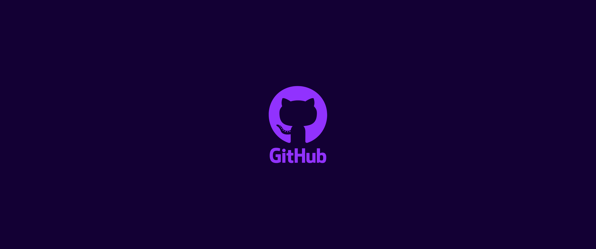
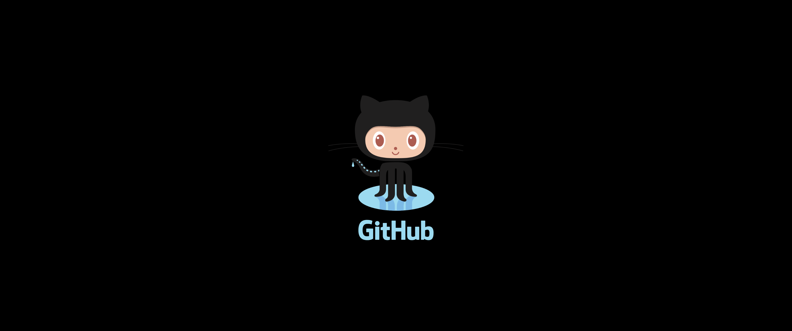

    
    <h1 align="center">Github Wallpapers</h1>
    <a href="https://github.com/Lucaffo/github-wallpapers/stargazers">
         </img>
    </a>
    </img>

    <h4> A unofficial github related wallpaper repository.</h4>

Still looking for your own custom github wallpaper? You haven't found anything on the internet, because hasn't anyone ever posted a palette you might like?

You are in the right place!

## Showcase

 ## How to create your custom palette
 
 1) Clone this repository.
 2) Install Adobe XD ( It's free to use ) and open the .xd file in this folder
 3) Tweek colors and image as you want.

**Note:**
Actually there are only ultrawide resolution, feel free to add new canvas with you style.

**Note 2:**
You can make these wallpapers with the software you like the most. Do not feel forced to use Adobe, we encourage the use of open source software such as [Krita](https://krita.org/en/), [Inkscape](https://inkscape.org/), [GIMP](https://www.gimp.org/) etc..

## How to contribute

You can contribute to this project creating new wallpapers to put inside teh _"/Wallpapers/[Resolution]"_ folder. 

After that create a pull requests and i will almost 100% accept your contribution! 
